# 📚 Guía de Estudio Completa — Parcial de CI/CD

> **Repositorio de referencia:** `Salome98342/Laboratorio-CI-CD` — FastAPI + React + PostgreSQL + GitHub Actions + SonarCloud  
> Esta guía cubre **todos** los conceptos aplicados en el laboratorio con teoría, tipos, ejemplos reales de la industria, diagramas y aplicación concreta en el código del repo.

---

## Tabla de contenido

| # | Tema |
|---|------|
| 1 | [Fundamentos: ¿Qué es CI/CD?](#1-fundamentos-qué-es-cicd) |
| 2 | [Ciclo de vida del software y por qué existe CI/CD](#2-ciclo-de-vida-del-software-y-por-qué-existe-cicd) |
| 3 | [Flujo de trabajo con Git y PRs (Git Flow)](#3-flujo-de-trabajo-con-git-y-prs-git-flow) |
| 4 | [GitHub Actions — anatomía completa](#4-github-actions--anatomía-completa) |
| 5 | [Análisis estático — Linters](#5-análisis-estático--linters) |
| 6 | [Pruebas automatizadas — Testing Pyramid](#6-pruebas-automatizadas--testing-pyramid) |
| 7 | [Cobertura de código](#7-cobertura-de-código) |
| 8 | [SonarCloud y Quality Gate](#8-sonarcloud-y-quality-gate) |
| 9 | [Artefactos (Artifacts) en pipelines](#9-artefactos-artifacts-en-pipelines) |
| 10 | [Branch Protection](#10-branch-protection) |
| 11 | [Docker en CI/CD](#11-docker-en-cicd) |
| 12 | [Recorrido de las tres etapas del laboratorio](#12-recorrido-de-las-tres-etapas-del-laboratorio) |
| 13 | [Diagnóstico de fallas comunes](#13-diagnóstico-de-fallas-comunes) |
| 14 | [Comandos de referencia](#14-comandos-de-referencia) |
| 15 | [Glosario extendido](#15-glosario-extendido) |
| 16 | [Preguntas de autoevaluación con guías de respuesta](#16-preguntas-de-autoevaluación-con-guías-de-respuesta) |
| 17 | [Checklist final antes del parcial](#17-checklist-final-antes-del-parcial) |
| 18 | [Resumen ejecutivo](#18-resumen-ejecutivo) |

---

## 1) Fundamentos: ¿Qué es CI/CD?

### 1.1 Continuous Integration (CI) — Integración Continua

**Definición formal:**  
Es la práctica de ingeniería de software en la que cada desarrollador integra su trabajo al repositorio compartido **varias veces al día**. Cada integración es verificada por un build automático y por pruebas, lo que permite detectar errores de integración tempranamente.

**Idea central:**  
> "Si integrar duele, hazlo más seguido hasta que deje de doler." — Martin Fowler

**Sin CI, el problema clásico es el "Integration Hell":**  
Dos desarrolladores trabajan durante dos semanas en sus ramas. Al intentar unir el trabajo, los cambios son tan divergentes que la integración toma días, hay conflictos de merge masivos y bugs que no existían en ninguna rama aparecen en la combinación.

**Con CI:**  
Los cambios son pequeños y frecuentes. Si hay un conflicto o un bug, se detecta en horas, no en días.

#### Tipos de triggers (disparadores) de CI

| Tipo | Cuándo ocurre | Uso real en la industria |
|------|--------------|--------------------------|
| **PR-based** | Al abrir o actualizar un Pull Request | GitHub, GitLab, Bitbucket — estándar en equipos modernos |
| **Push-based** | Al hacer `git push` a una rama | Pipelines de validación de branches de feature |
| **Scheduled (cron)** | Periódicamente (ej. cada noche a las 2 AM) | Pruebas de regresión largas, análisis de seguridad, scraping de datos |
| **Manual (workflow_dispatch)** | Un humano lo activa desde la UI | Despliegues a producción, releases que requieren aprobación |
| **Webhook externo** | Otro sistema lo dispara | Integración con Jira, Slack, herramientas de QA |

**En este repositorio:**
- `ci-develop.yml` → disparado por `pull_request` hacia `develop`
- `ci-master.yml` → disparado por `pull_request` hacia `master` o `main`

#### Flujo visual de CI

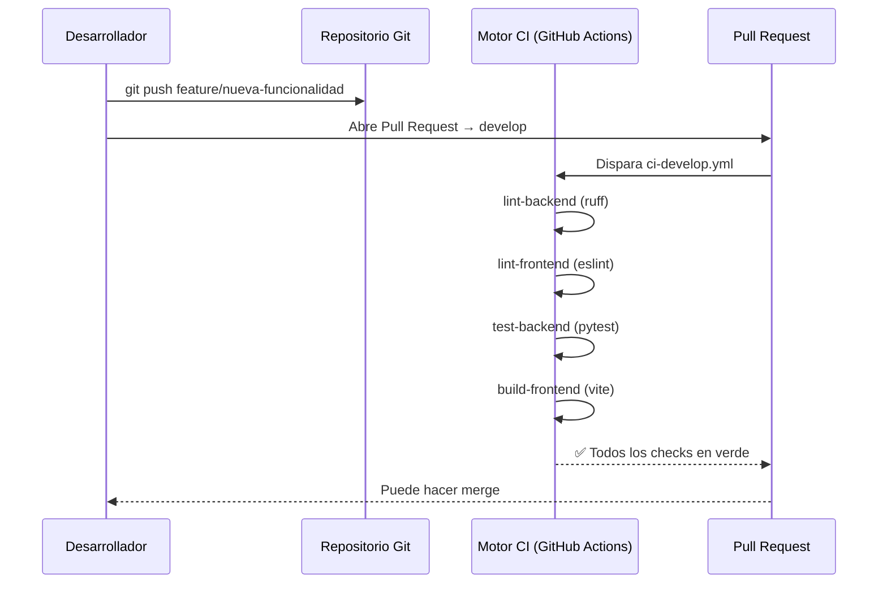

---

### 1.2 Continuous Delivery (CD) — Entrega Continua

**Definición:**  
Práctica donde el software siempre está en un estado **listo para desplegar** a producción. El despliegue real puede ser manual, pero el pipeline lo prepara y valida todo automáticamente.

**Ejemplo real — Amazon:**  
Amazon despliega cambios a producción miles de veces al día. Cada cambio pasa por un pipeline automatizado. El equipo humano decide *cuándo* activar el feature (con feature flags), pero el código ya está en producción.

**Ejemplo real — Banco o empresa regulada:**  
El pipeline genera automáticamente el artefacto desplegable y lo deja listo en un ambiente de staging. Un gerente o equipo de QA lo aprueba manualmente antes de ir a producción. Esto es **Delivery** (no Deployment).

---

### 1.3 Continuous Deployment — Despliegue Continuo

**Definición:**  
Extensión total de CI/CD donde **cada cambio que pasa el pipeline** es desplegado automáticamente a producción sin intervención humana.

**Ejemplo real — Netflix:**  
Netflix usa Spinnaker para desplegar automáticamente a producción. Si todos los checks pasan (canary deployment, métricas de error rate, latencia), el despliegue continúa sin que nadie lo apruebe manualmente.

**Ejemplo real — Startups SaaS:**  
Una startup de software B2C puede desplegar su frontend a Vercel o Netlify automáticamente en cada merge a `main`. El usuario siempre tiene la versión más nueva.

---

### 1.4 Diferencia entre las tres prácticas

```
┌─────────────────────────────────────────────────────────────────────┐
│                                                                     │
│  CODE   →  CI   →  STAGING   →   ¿PRODUCCIÓN?                      │
│                                                                     │
│  CI:     Sí valida ✅  |  No se preocupa por el despliegue          │
│  CD:     Sí valida ✅  |  Deja listo ✅  |  Aprobación manual 👤    │
│  CDep:   Sí valida ✅  |  Despliega solo ✅  |  Sin humano 🤖        │
│                                                                     │
└─────────────────────────────────────────────────────────────────────┘
```

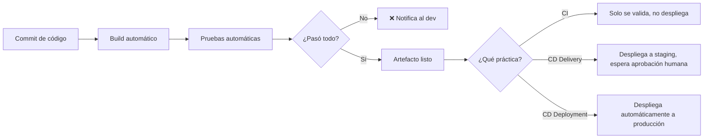

---

## 2) Ciclo de vida del software y por qué existe CI/CD

### 2.1 El problema antes de CI/CD

En equipos sin CI/CD el ciclo típico es:
1. Un desarrollador trabaja 2-4 semanas en una rama.
2. Intenta mergear todo al final.
3. Hay 500 conflictos de merge.
4. Las pruebas se corren solo antes del release.
5. El release toma días, hay rollbacks, se trabaja los fines de semana.

### 2.2 Métricas DORA (clave para entender el valor de CI/CD)

Las métricas **DORA** (DevOps Research and Assessment) son el estándar de la industria para medir madurez de CI/CD:

| Métrica | ¿Qué mide? | Elite (con buen CI/CD) | Bajo rendimiento |
|---------|-----------|----------------------|------------------|
| **Deployment Frequency** | ¿Cada cuánto se despliega? | Múltiples veces al día | Una vez por mes o menos |
| **Lead Time for Changes** | ¿Cuánto tarda un commit en llegar a producción? | Menos de 1 hora | 1-6 meses |
| **Change Failure Rate** | ¿Qué % de cambios genera incidentes? | 0–15% | 46–60% |
| **Mean Time to Restore** | ¿Cuánto tarda en recuperarse de un fallo? | Menos de 1 hora | 1-6 meses |

**Conclusión:** Los equipos con buen CI/CD despliegan más rápido **y** tienen menos fallos. No es un trade-off, es una mejora en ambas dimensiones.

---

## 3) Flujo de trabajo con Git y PRs (Git Flow)

### 3.1 ¿Qué es Git Flow?

**Definición:**  
Modelo de ramificación propuesto por Vincent Driessen (2010) que define ramas con roles específicos para organizar el desarrollo en equipos.

**En la industria lo usan:** empresas con releases versionados, software on-premise, apps móviles, librerías de código abierto.

**Alternativa — Trunk Based Development:** empresas como Google, Facebook. Un solo `main`, feature flags, integraciones diarias directas. No requiere `develop`.

### 3.2 Modelo de ramas de este laboratorio

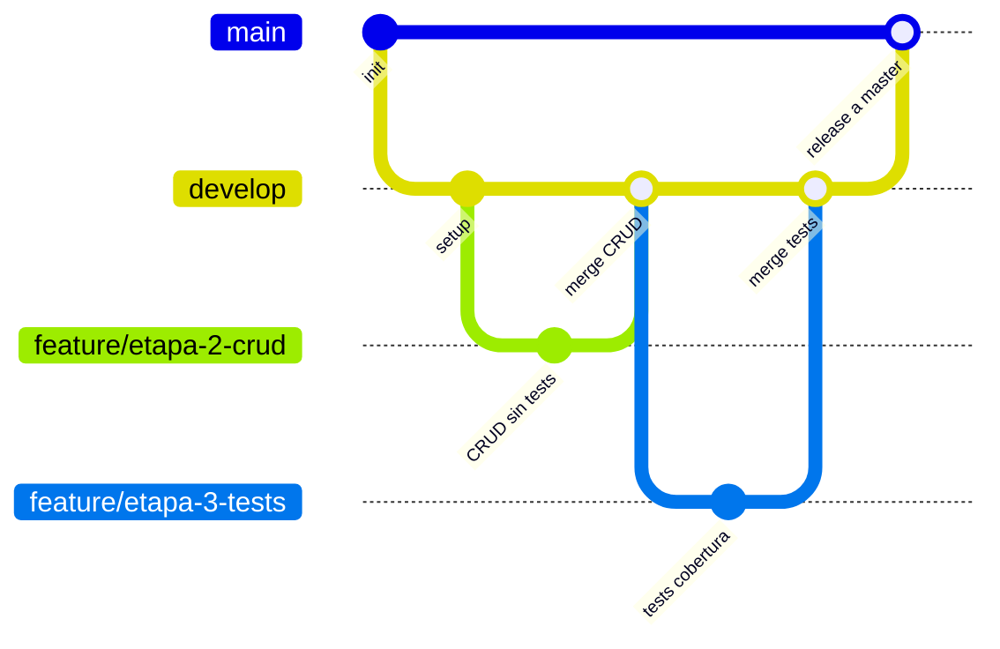

### 3.3 Roles de cada rama

| Rama | Propósito | Pipeline asociado | ¿Quién puede hacer push? |
|------|-----------|------------------|--------------------------|
| `master` / `main` | Código estable, producción | `ci-master.yml` (estricto) | Solo via PR desde `develop` |
| `develop` | Integración diaria | `ci-develop.yml` (rápido) | Solo via PR desde `feature/*` |
| `feature/*` | Trabajo aislado por funcionalidad | Sin pipeline propio | El desarrollador asignado |

### 3.4 ¿Por qué dos pipelines distintos?

**Pipeline rápido (develop):** el desarrollador necesita feedback en minutos, no en media hora. Se valida lo esencial (lint + tests básicos + build). Se acepta que en `develop` las cosas estén "en progreso".

**Pipeline estricto (master):** antes de integrar código a la rama que representa producción, se exige calidad total: cobertura ≥ 80%, análisis Sonar, build de Docker. Si falla, el PR queda bloqueado.

### 3.5 Flujo completo del laboratorio

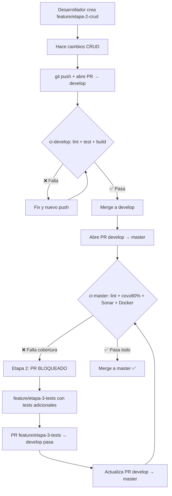

---

## 4) GitHub Actions — anatomía completa

### 4.1 ¿Qué es GitHub Actions?

**Definición:**  
Plataforma de CI/CD integrada en GitHub que permite automatizar flujos de trabajo directamente en el repositorio, usando archivos YAML en `.github/workflows/`.

**En la industria lo usan:** GitHub lo usa para CI/CD de la mayoría de proyectos de código abierto (React, Vue, TypeScript, etc.) y millones de repos privados empresariales.

**Alternativas comparadas:**

| Herramienta | Dónde se usa | Diferencia principal |
|-------------|-------------|---------------------|
| GitHub Actions | GitHub | Nativo, fácil integración, marketplace |
| GitLab CI | GitLab | Más control sobre infraestructura |
| Jenkins | On-premise | Máximo control, más complejo |
| CircleCI | Cualquier repo | Velocidad, paralelismo avanzado |
| Azure DevOps | Empresas Microsoft | Integración con Azure y herramientas MS |
| Bitbucket Pipelines | Atlassian | Ecosistema Jira/Confluence |

### 4.2 Anatomía de un workflow YAML

```yaml
# Nombre del workflow (aparece en la pestaña Actions de GitHub)
name: ci-develop

# Evento que lo dispara (puede ser lista de eventos)
on:
  pull_request:
    branches: [develop]   # Solo PR cuyo destino sea 'develop'

# Permisos que el runner necesita sobre el repo
permissions:
  contents: read

# Lista de jobs. Se ejecutan en PARALELO por defecto (salvo que usen 'needs')
jobs:

  lint-backend:                      # ID del job (snake_case, sin espacios)
    name: Lint backend (ruff)        # Nombre legible en la UI
    runs-on: ubuntu-latest           # Sistema operativo del runner

    steps:                           # Pasos secuenciales dentro del job

      - uses: actions/checkout@v4    # Action de GitHub: clona el repositorio

      - uses: actions/setup-python@v5  # Action: instala Python
        with:
          python-version: "3.12.10"
          cache: pip                 # Cachea las dependencias para siguientes runs

      - name: Instalar dependencias
        working-directory: backend   # Cambia el directorio de trabajo
        run: pip install -r requirements.txt  # Comando shell

      - name: Ejecutar ruff
        working-directory: backend
        run: ruff check app          # Si retorna código ≠ 0, el step falla
```

### 4.3 Elementos clave y sus propósitos

| Elemento | Tipo | Propósito | Ejemplo en el repo |
|----------|------|-----------|-------------------|
| `on` | Trigger | Define cuándo corre el workflow | `pull_request: branches: [develop]` |
| `jobs` | Estructura | Agrupa steps en unidades de trabajo | `lint-backend`, `test-backend-coverage` |
| `runs-on` | Config | Elige el SO del runner | `ubuntu-latest` (Linux, gratis) |
| `uses` | Action | Reutiliza una action del marketplace | `actions/checkout@v4` |
| `run` | Comando | Ejecuta shell commands | `pytest --cov=app --cov-fail-under=80` |
| `needs` | Dependencia | Encadena jobs secuencialmente | `needs: [test-backend-coverage, test-frontend-coverage]` |
| `if: always()` | Condicional | Corre aunque el job anterior falle | Usado en el job de SonarCloud |
| `working-directory` | Contexto | Cambia el directorio base | `working-directory: backend` |
| `with` | Parámetros | Parámetros de una action | `python-version: "3.12.10"` |
| `cache` | Optimización | Cachea dependencias entre runs | `cache: pip` o `cache: npm` |

### 4.4 Diagrama de dependencias entre jobs (ci-master.yml)

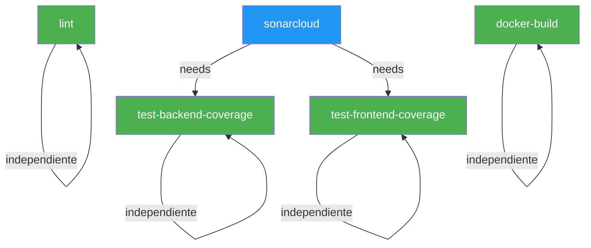

**Explicación:** Los jobs `lint`, `test-backend-coverage`, `test-frontend-coverage` y `docker-build` corren **en paralelo**. El job `sonarcloud` espera a que ambos jobs de cobertura terminen (para poder leer los reportes), y usa `if: always()` para correr incluso si la cobertura falló (así Sonar también reporta el fallo de cobertura).

### 4.5 Runners: tipos y cuándo usarlos

| Tipo de runner | Descripción | Cuándo usar |
|----------------|-------------|-------------|
| `ubuntu-latest` | VM Ubuntu en infra de GitHub | La mayoría de builds; gratuito en repos públicos |
| `windows-latest` | VM Windows en infra de GitHub | Tests que requieren Windows (.NET, PowerShell) |
| `macos-latest` | VM macOS en infra de GitHub | Apps iOS/macOS, builds de Xcode |
| `self-hosted` | Máquina propia | GPU para ML, builds que necesitan hardware especial, acceso a red interna |

### 4.6 Costos y límites (dato de examen)

- Repos **públicos**: GitHub Actions es **gratuito** e ilimitado.
- Repos **privados**: plan gratuito incluye 2000 minutos/mes en ubuntu-latest.
- Repos privados en organizaciones: depende del plan (GitHub Team, Enterprise).
- `ubuntu-latest` consume 1x los minutos; `windows-latest` consume 2x; `macos-latest` consume 10x.

---

## 5) Análisis estático — Linters

### 5.1 ¿Qué es el análisis estático?

**Definición:**  
Inspección del código fuente **sin ejecutarlo**. Analiza la estructura, patrones y convenciones del código para detectar errores, vulnerabilidades y desviaciones de estilo.

**Analogía:** es como un corrector ortográfico y gramatical para código. No te dice si el texto tiene sentido, pero sí que la gramática es correcta y el estilo es consistente.

**En la vida real lo usan:**
- **Google** requiere que todo código pase linters antes de code review.
- **Airbnb** tiene su propia configuración de ESLint publicada como estándar de la industria.
- **Microsoft** usa StyleCop y Roslyn analyzers en todos sus repos .NET.

### 5.2 Tipos de análisis estático

| Tipo | ¿Qué detecta? | Ejemplo |
|------|--------------|---------|
| **Estilo y formato** | Indentación, espacios, longitud de línea | Línea de 120+ chars en Python |
| **Errores de lógica** | Variables no usadas, imports innecesarios | `import os` importado pero nunca usado |
| **Seguridad** | Patrones peligrosos, injection, secretos hardcodeados | `eval(user_input)` |
| **Complejidad** | Funciones demasiado complejas o largas | Función con 10 niveles de if anidados |
| **Bugs potenciales** | Comparaciones con None mal hechas | `if x == None` en vez de `if x is None` |
| **Convenciones del lenguaje** | Idioms modernos del lenguaje | Usar f-strings en vez de `.format()` |

### 5.3 Ruff (Python) — backend

**Qué es:** linter y formatter para Python escrito en Rust, extremadamente rápido (100x más rápido que Flake8). Reemplaza Flake8, isort, pyupgrade y más.

**Configuración en este repo** (`pyproject.toml`):
```toml
[tool.ruff]
line-length = 100
target-version = "py312"
extend-exclude = ["tests"]  # No aplica linting a los tests

[tool.ruff.lint]
select = ["E", "F", "I", "B", "UP"]
# E = errores de estilo (PEP8)
# F = pyflakes (variables no usadas, imports innecesarios)
# I = isort (orden de imports)
# B = flake8-bugbear (bugs potenciales)
# UP = pyupgrade (usar sintaxis moderna de Python)
```

**Ejemplo de error que detectaría Ruff:**
```python
# ❌ ANTES: código que Ruff rechazaría
import os
import sys
import os          # E401: importado dos veces
from typing import List, Dict  # UP006/UP035: usar list/dict en Python 3.12+

def calcular(x,y):  # E231: falta espacio después de coma
    resultado=x+y   # E225: falta espacio alrededor del operador
    return resultado

# ✅ DESPUÉS: código que Ruff acepta
import sys

def calcular(x, y):
    resultado = x + y
    return resultado
```

**Cómo se ejecuta en CI:**
```bash
cd backend
ruff check app     # Retorna código 0 si todo bien, código 1 si hay errores
```

### 5.4 ESLint (TypeScript/React) — frontend

**Qué es:** linter estándar para JavaScript/TypeScript. Altamente configurable con plugins.

**Configuración en este repo** (`package.json`):
```json
"scripts": {
  "lint": "eslint src --ext ts,tsx --max-warnings 0"
  // --max-warnings 0 = ni una advertencia permitida, todo debe ser error cero
}
```

**Ejemplo de error que detectaría ESLint:**
```typescript
// ❌ ANTES: código que ESLint rechazaría
import { useState } from 'react'
import axios from 'axios'  // Importado pero no usado

function App() {
  const [count, setCount] = useState(0)
  // react-hooks/exhaustive-deps: useEffect con dependencias faltantes
  useEffect(() => {
    fetchData()
  }, [])  // 'fetchData' falta en las dependencias

  return <div>{count}</div>
}

// ✅ DESPUÉS: código que ESLint acepta
import { useState, useEffect, useCallback } from 'react'

function App() {
  const [count, setCount] = useState(0)
  const fetchData = useCallback(() => { /* ... */ }, [])
  useEffect(() => {
    fetchData()
  }, [fetchData])  // dependencia declarada

  return <div>{count}</div>
}
```

### 5.5 Comparativa de linters populares

| Linter | Lenguaje | Velocidad | Popularidad en industria |
|--------|----------|-----------|--------------------------|
| **Ruff** | Python | ⚡ Muy alta (Rust) | Creciendo rápido, adoptado por FastAPI, Pydantic |
| **Flake8** | Python | Media | Legacy, muy establecido |
| **ESLint** | JS/TS | Media | Estándar absoluto en frontend |
| **Prettier** | Multi | Alta | Formateador (no linter), complementa ESLint |
| **RuboCop** | Ruby | Media | Estándar en Rails |
| **golangci-lint** | Go | Alta | Estándar en Go |
| **ktlint** | Kotlin | Media | Android/JVM |

---

## 6) Pruebas automatizadas — Testing Pyramid

### 6.1 ¿Qué son?

**Definición:**  
Validaciones automáticas del comportamiento esperado del software, ejecutadas sin intervención humana. Cada prueba verifica que una pieza del sistema funciona correctamente bajo condiciones específicas.

**Por qué son críticas en CI/CD:**  
Sin pruebas automatizadas, CI no puede garantizar que el código que pasó lint también funciona correctamente. Los linters verifican *forma*; los tests verifican *comportamiento*.

### 6.2 La Pirámide de Pruebas (Testing Pyramid)

```
                         ▲
                        / \
                       /   \
                      / E2E \         Pocas, lentas, costosas
                     /       \        Selenium, Cypress, Playwright
                    /─────────\
                   /           \
                  / Integración \     Medianas en cantidad
                 /               \   TestClient de FastAPI, 
                /─────────────────\  supertest en Express
               /                   \
              /      Unitarias       \ Muchas, rápidas, baratas
             /                       \ pytest, Vitest, Jest, JUnit
            /─────────────────────────\
```

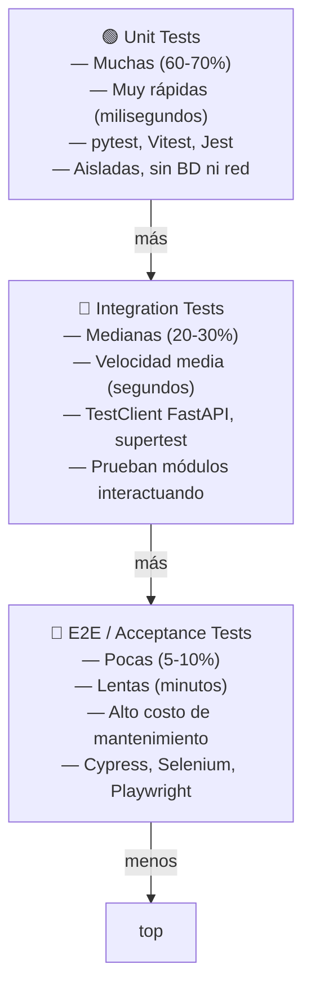

### 6.3 Tests unitarios

**Definición:** prueban una **unidad mínima** de código (una función, un método, un componente) en aislamiento. No dependen de base de datos, red ni servicios externos.

**Cuándo usarlos:** para lógica de negocio, funciones de utilidad, validaciones, cálculos.

**Ejemplo real de este repo** — test del modelo `Task`:
```python
# backend/tests/test_tasks_extra.py
def test_model_helpers():
    from app.models import Task

    t = Task(title="t")
    assert t.completed in (False, None)
    t.mark_completed()
    assert t.completed is True    # Prueba el método mark_completed()
    t.mark_pending()
    assert t.completed is False   # Prueba el método mark_pending()
```

Este test NO necesita base de datos ni servidor. Es puro Python.

### 6.4 Tests de integración

**Definición:** verifican que varios módulos funcionan correctamente **juntos**. En el contexto de APIs, esto incluye llamar al endpoint completo (router → controller → DB).

**Cuándo usarlos:** para validar endpoints, workflows de usuario, operaciones CRUD.

**Ejemplo real de este repo** — test de integración del endpoint CRUD:
```python
# backend/tests/test_tasks_extra.py
def test_get_by_id_ok_and_404(client):
    # 1. Crea una tarea vía POST /tasks
    created = _create(client, title="X")

    # 2. Obtiene la tarea vía GET /tasks/{id}
    ok = client.get(f"/tasks/{created['id']}")
    assert ok.status_code == 200
    assert ok.json()["title"] == "X"

    # 3. Intenta obtener una tarea inexistente
    miss = client.get("/tasks/9999")
    assert miss.status_code == 404
    assert miss.json()["detail"] == "Task not found"
```

Este test verifica que el router, el controller y la BD (SQLite en memoria para tests) funcionan juntos.

**El conftest.py sustituye PostgreSQL por SQLite en memoria para tests:**
```python
# backend/tests/conftest.py
os.environ["DATABASE_URL"] = "sqlite+pysqlite:///:memory:"
# Esto permite correr tests sin levantar Docker
```

### 6.5 Tests de frontend (Vitest + Testing Library)

**Ejemplo real de este repo:**
```typescript
// Prueba que el componente App renderiza correctamente
// y que puede hacer fetch de tareas
```

**Herramientas del repo:**
- `vitest` — framework de testing, compatible con Vite
- `@testing-library/react` — utilidades para renderizar componentes
- `@testing-library/user-event` — simula interacciones de usuario reales
- `jsdom` — simula el DOM del navegador en Node.js

### 6.6 Comparativa de frameworks de testing

| Framework | Lenguaje | Tipo | Usado en industria |
|-----------|----------|------|-------------------|
| **pytest** | Python | Unit + Integration | Django, FastAPI, Flask, ciencia de datos |
| **Vitest** | TypeScript/JS | Unit + Component | Proyectos Vite, Vue, React moderno |
| **Jest** | TypeScript/JS | Unit + Component | React (CRA), Node.js, Next.js |
| **JUnit 5** | Java | Unit + Integration | Spring Boot, Android |
| **RSpec** | Ruby | Unit + Integration + E2E | Rails |
| **Cypress** | JS | E2E | Frontend, cualquier app web |
| **Playwright** | Multi | E2E | Microsoft, recomendado para apps modernas |

---

## 7) Cobertura de código

### 7.1 ¿Qué mide exactamente?

**Definición:**  
Porcentaje del código fuente que fue **ejecutado** al menos una vez durante la ejecución de la suite de tests. Cuanto mayor es el porcentaje, más líneas de código han sido "ejercitadas" por los tests.

### 7.2 Tipos de métricas de cobertura

| Tipo | ¿Qué mide? | Ejemplo |
|------|-----------|---------|
| **Line coverage** | % de líneas ejecutadas | Si hay 100 líneas y los tests ejecutan 85, = 85% |
| **Branch coverage** | % de ramas de `if/else` tomadas | Si un `if` tiene `true` y `false` y solo se prueba `true`, = 50% de esa rama |
| **Function coverage** | % de funciones/métodos llamados | Si hay 10 funciones y 8 son llamadas en tests, = 80% |
| **Statement coverage** | % de sentencias ejecutadas | Similar a line coverage pero más granular |

### 7.3 Ejemplo visual de un reporte de cobertura (pytest-cov)

```
---------- coverage: platform linux, python 3.12.10-final-0 -----------
Name                           Stmts   Miss  Cover   Missing
--------------------------------------------------------------
backend/app/controllers/...       25      3    88%   45-47
backend/app/models/__init__.py    12      0   100%
backend/app/views/task_routes.py  52      8    85%   78, 82-89
--------------------------------------------------------------
TOTAL                             89     11    88%
```

**Interpretación:**
- `task_routes.py` líneas 78 y 82-89 no están cubiertas → ahí faltan tests
- `models/__init__.py` tiene 100% de cobertura

### 7.4 ¿Por qué el umbral es 80% y no 100%?

```
          Costo de tests vs Beneficio de cobertura
          
Beneficio  ▲
           │   ███
           │  █████
           │ ████████
           │██████████████
           │██████████████████
           │████████████████████████████
           └─────────────────────────────► Cobertura
           0%       80%    90%  95%  100%
```

- De 0% a 80%: el beneficio crece rápidamente. Cada test nuevo cubre lógica importante.
- De 80% a 100%: el costo sube exponencialmente (código generado automáticamente, `__init__.py`, getters/setters) y el beneficio marginal cae.
- 100% de cobertura puede ser **falsa seguridad**: tests vacíos que ejecutan el código pero no verifican nada.

**Comando de este repo que fuerza el umbral:**
```bash
pytest --cov=app --cov-report=xml --cov-report=term --cov-fail-under=80
# --cov-fail-under=80 → si la cobertura total es < 80%, pytest retorna código 1 → el job de CI falla
```

### 7.5 Anti-patrones de cobertura (para el parcial)

| Anti-patrón | Descripción | Por qué es malo |
|-------------|-------------|-----------------|
| **Test vacío** | Test que ejecuta código pero no tiene `assert` | Sube cobertura pero no verifica comportamiento |
| **Testing implementation** | Test que verifica cómo funciona internamente (mocks excesivos) | Frágil: falla al refactorizar sin cambiar comportamiento |
| **Happy path only** | Solo se prueban los casos exitosos | Los bugs viven en los casos de error y edge cases |
| **Coverage gaming** | Añadir tests de getters/setters triviales solo para subir % | Desperdicia tiempo, no da seguridad real |

---

## 8) SonarCloud y Quality Gate

### 8.1 ¿Qué es SonarCloud?

**Definición:**  
Plataforma SaaS de análisis continuo de calidad de código, mantenida por SonarSource. Analiza el código para detectar bugs, vulnerabilidades, code smells y problemas de mantenibilidad.

**Diferencia con un linter:**
- **Linter:** analiza un archivo a la vez, reglas de estilo/sintaxis básicas
- **SonarCloud:** analiza el proyecto entero, relaciones entre archivos, historial de deuda técnica, integra reportes de cobertura externos

**Ejemplos de uso real:**
- Miles de proyectos open source en GitHub usan SonarCloud gratis
- Empresas como Siemens, IBM y Amadeus usan SonarQube (versión on-premise)
- El gobierno francés exige análisis Sonar para aplicaciones gubernamentales

### 8.2 Categorías de issues que detecta Sonar

| Categoría | Descripción | Ejemplo |
|-----------|-------------|---------|
| **Bug** | Código que claramente está mal | `if (x = null)` en vez de `==` |
| **Vulnerability** | Riesgo de seguridad explotable | SQL query construida con concatenación de strings |
| **Security Hotspot** | Riesgo potencial que requiere revisión | `eval()`, uso de `MD5` para hashing |
| **Code Smell** | Código que funciona pero es difícil de mantener | Función de 300 líneas, código duplicado |
| **Coverage** | Porcentaje de cobertura de tests | Integrado desde reportes externos (pytest-cov, lcov) |

### 8.3 El Quality Gate

**Definición:**  
Conjunto de condiciones booleanas (pasa/falla) que determinan si el código nuevo cumple los estándares de calidad definidos para el proyecto.

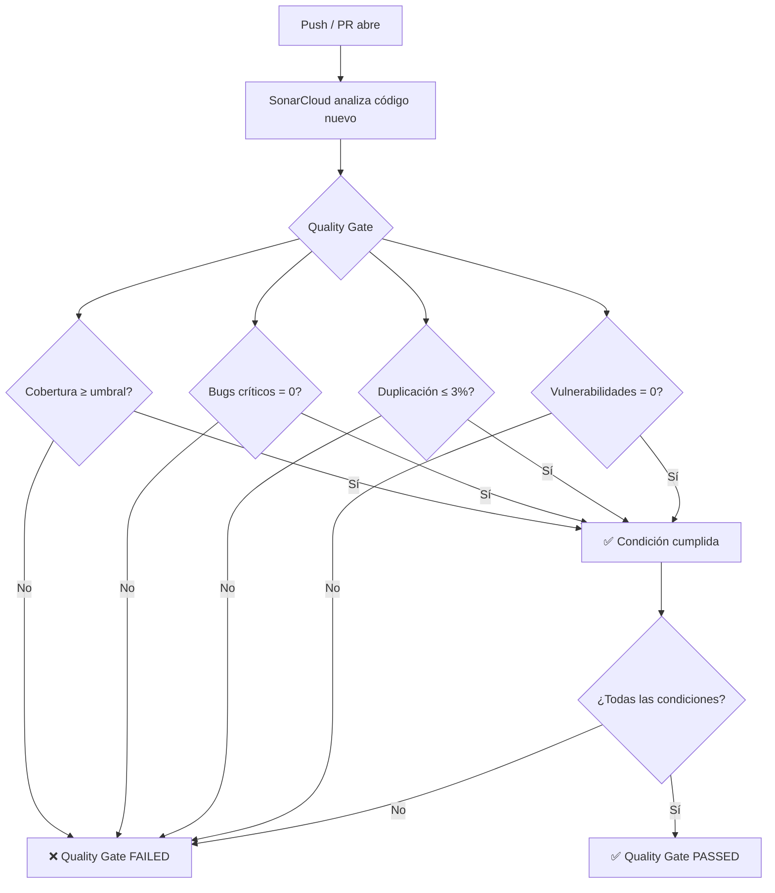

### 8.4 Condiciones típicas de un Quality Gate

| Condición | Valor típico | ¿Qué pasa si falla? |
|-----------|-------------|---------------------|
| **Coverage on new code** | ≥ 80% | El PR queda bloqueado |
| **Duplicated lines on new code** | < 3% | Señal de copy-paste, código duplicado |
| **New Blocker Issues** | = 0 | Bug o vulnerabilidad de máxima severidad |
| **New Critical Issues** | = 0 | Problema que afecta producción |
| **Reliability Rating** | A o B | Score general de confiabilidad |
| **Security Rating** | A | Score de seguridad |

### 8.5 Configuración en este repo (sonar-project.properties)

```properties
sonar.projectKey=Salome98342_Laboratorio-CI-CD
sonar.organization=salome98342

# Fuentes de código de la aplicación (no tests)
sonar.sources=backend/app,frontend/src

# Dónde están los tests
sonar.tests=backend/tests,frontend/src/__tests__

# Reportes de cobertura (generados por pytest-cov y vitest)
sonar.python.coverage.reportPaths=backend/coverage.xml
sonar.javascript.lcov.reportPaths=frontend/coverage/lcov.info
```

### 8.6 Flujo de datos de cobertura hacia SonarCloud

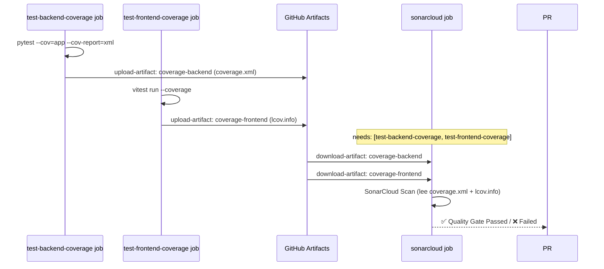

---

## 9) Artefactos (Artifacts) en pipelines

### 9.1 ¿Qué son?

**Definición:**  
Archivos que un job genera durante su ejecución y que son **almacenados temporalmente** en la infraestructura de GitHub Actions para ser descargados por otros jobs o conservados como evidencia de la ejecución.

**En la vida real:**
- Reportes de cobertura para análisis de calidad
- Binarios compilados para pasar de un job de build a un job de deploy
- Reportes de pruebas para auditoría
- Capturas de pantalla de tests E2E fallidos
- Artefactos de release (`.jar`, `.exe`, `.whl`)

### 9.2 Artifacts en este repo

```yaml
# En ci-master.yml — test-backend-coverage job:
- name: pytest con cobertura
  run: pytest --cov=app --cov-report=xml --cov-fail-under=80
  # Genera: backend/coverage.xml

- name: Subir reporte como artifact
  if: always()   # ← incluso si pytest falló, preserva el reporte
  uses: actions/upload-artifact@v4
  with:
    name: coverage-backend     # ← nombre del artifact
    path: backend/coverage.xml # ← qué archivo subir
```

```yaml
# En ci-master.yml — sonarcloud job:
- name: Descargar reporte backend
  uses: actions/download-artifact@v4
  with:
    name: coverage-backend   # ← mismo nombre que se subió
    path: backend            # ← dónde descargarlo
  continue-on-error: true    # ← no fallar si el artifact no existe
```

### 9.3 Ciclo de vida de artifacts

| Fase | Acción | Herramienta |
|------|--------|-------------|
| Generación | El job corre tests y genera archivos | `pytest --cov-report=xml` |
| Upload | El job sube el archivo a GitHub | `actions/upload-artifact@v4` |
| Almacenamiento | GitHub guarda el archivo (por defecto 90 días) | Infraestructura GitHub |
| Download | Otro job descarga el archivo | `actions/download-artifact@v4` |
| Consumo | Otro job usa el archivo | SonarCloud lee `coverage.xml` |

---

## 10) Branch Protection

### 10.1 ¿Qué es?

**Definición:**  
Conjunto de reglas configurables en GitHub a nivel de rama que impiden ciertos tipos de acciones sobre esa rama sin que se cumplan las condiciones definidas.

**Sin Branch Protection:** cualquier desarrollador podría hacer `git push -f master` y sobreescribir el historial, o mergear código sin que CI haya pasado.

**Con Branch Protection:** las reglas se convierten en restricciones técnicas que GitHub hace cumplir automáticamente.

### 10.2 Opciones de Branch Protection (tabla completa)

| Opción | Descripción | Cuándo activarla |
|--------|-------------|-----------------|
| **Require a pull request before merging** | Nadie puede hacer push directo | Siempre en `master` / `main` |
| **Require approvals** | N revisores deben aprobar el PR | Equipos medianos/grandes (1-2 aprobaciones) |
| **Dismiss stale pull request approvals** | Las aprobaciones se invalidan si hay nuevos commits | Cuando la seguridad de reviews es crítica |
| **Require status checks to pass** | Checks específicos de CI deben estar en verde | Siempre que haya CI configurado |
| **Require branches to be up to date** | La rama del PR debe estar actualizada con `master` | Para evitar bugs de integración |
| **Require conversation resolution** | Todos los comentarios de review deben estar resueltos | Equipos que hacen code review riguroso |
| **Require signed commits** | Los commits deben estar firmados con GPG | Empresas con requisitos de auditoría |
| **Require linear history** | No permite merge commits, solo fast-forward | Historial limpio, trunk-based development |
| **Do not allow bypassing the above settings** | Ni los admins pueden saltarse las reglas | Máxima seguridad |
| **Restrict who can push** | Solo ciertas personas/bots pueden pushear | Proteger releases automáticos |

### 10.3 Flujo de branch protection en acción

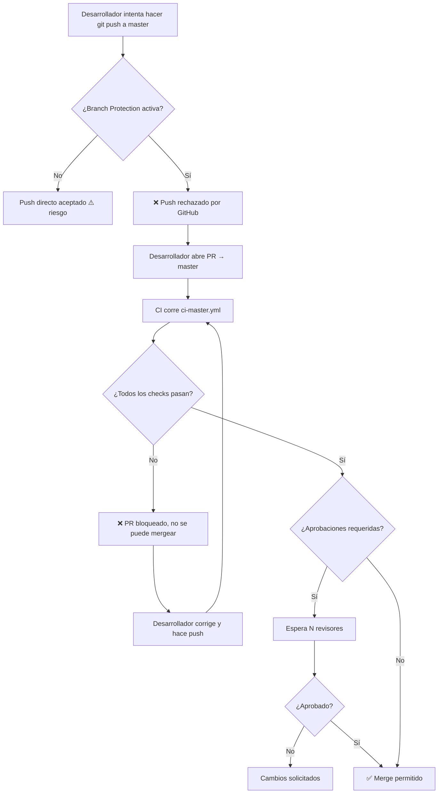

---

## 11) Docker en CI/CD

### 11.1 ¿Qué es Docker y por qué es relevante en CI/CD?

**Definición:**  
Plataforma de contenedores que empaqueta una aplicación y todas sus dependencias en una unidad estandarizada llamada **imagen Docker**. Esta imagen puede ejecutarse de forma idéntica en cualquier máquina.

**El problema que resuelve en CI/CD:**  
"Funciona en mi máquina" es el enemigo de la entrega continua. Si el CI corre en una VM con Ubuntu pero producción corre en otra, pueden haber diferencias sutiles. Docker garantiza que el entorno de test y producción son idénticos.

### 11.2 Tipos de uso de Docker en pipelines

| Tipo | Descripción | Ejemplo real |
|------|-------------|-------------|
| **Build-only** | Solo se construye la imagen para verificar que no hay errores | Este laboratorio: `docker compose build` |
| **Build + test** | La imagen se construye y los tests corren dentro del contenedor | Proyectos que necesitan servicios (Redis, Kafka) |
| **Build + push** | La imagen se construye y se publica en un registry (DockerHub, GHCR, ECR) | Pipelines de CI completos de empresas |
| **Build + deploy staging** | La imagen se despliega automáticamente a un ambiente de QA | Continuous Delivery a staging |
| **Build + deploy prod** | La imagen se despliega directamente a producción | Continuous Deployment con Kubernetes |

### 11.3 Arquitectura Docker de este repositorio

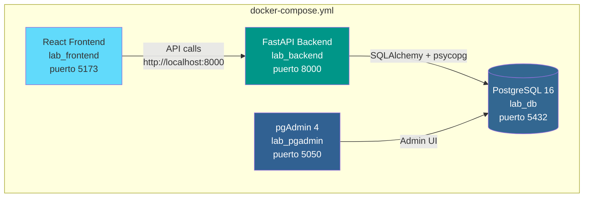

### 11.4 Stages de Docker en un pipeline CI/CD completo (referencia)

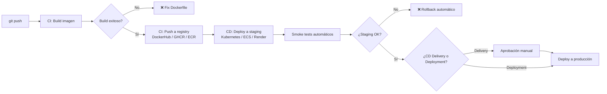

---

## 12) Recorrido de las tres etapas del laboratorio

### 12.1 Vista general de las tres etapas

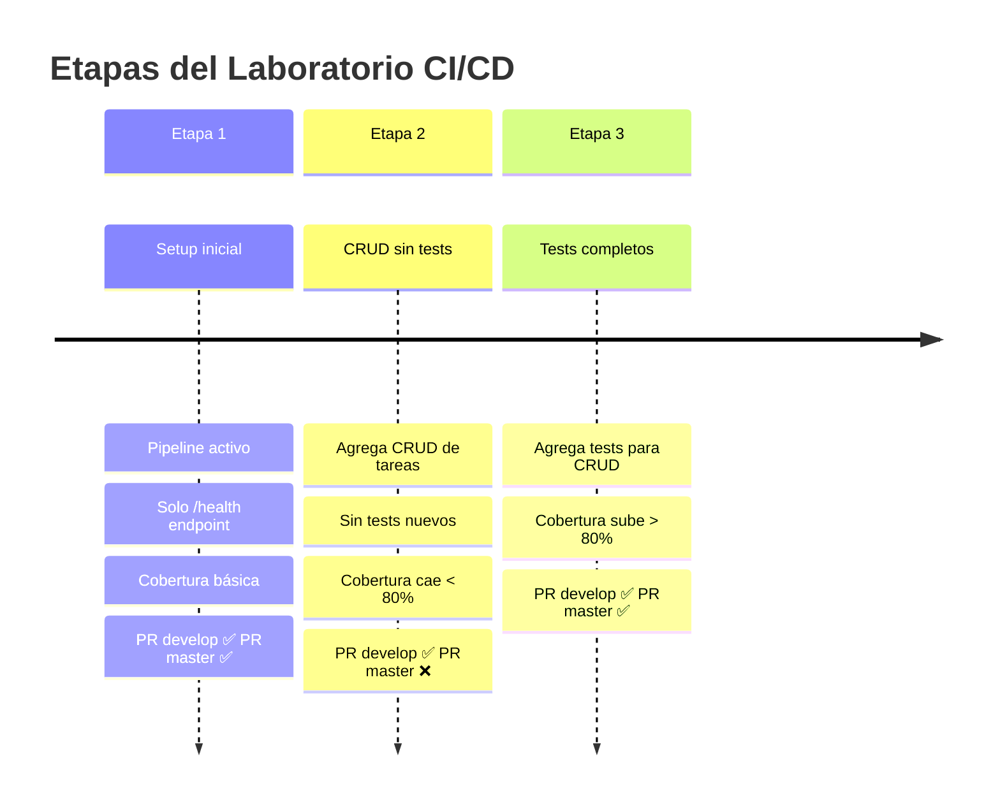

### 12.2 Etapa 1: Setup inicial

**Estado del código:**
- Solo el endpoint `/health` que retorna `{"status": "ok"}`
- Pipeline activo y configurado
- Cobertura: alta porque hay poco código

**Resultado esperado de cada pipeline:**

| Pipeline | Resultado | ¿Por qué? |
|----------|-----------|-----------|
| `ci-develop` | ✅ PASS | Lint pasa, test_health_ok pasa, build OK |
| `ci-master` | ✅ PASS | Cobertura del endpoint /health > 80% |

**Test de la Etapa 1:**
```python
# backend/tests/test_health.py
def test_health_ok(client):
    response = client.get("/health")
    assert response.status_code == 200
    assert response.json() == {"status": "ok"}
```

### 12.3 Etapa 2: CRUD sin tests

**Estado del código:**
- Se añaden endpoints CRUD: `GET /tasks`, `POST /tasks`, `PUT /tasks/{id}`, `DELETE /tasks/{id}`, `GET /tasks/count`, `POST /tasks/{id}/toggle`
- No se añaden tests para el nuevo código
- La cobertura cae porque hay muchas líneas nuevas sin cubrir

**¿Por qué falla la cobertura?**
```
Antes de etapa 2:   10 líneas código, 10 cubiertas → 100%
Después de etapa 2: 90 líneas código, 10 cubiertas → ~11%  ❌ < 80%
```

**Resultado esperado:**

| Pipeline | Resultado | ¿Por qué? |
|----------|-----------|-----------|
| `ci-develop` (feature → develop) | ✅ PASS | Sin gate de cobertura estricto |
| `ci-master` (develop → master) | ❌ FAIL | `--cov-fail-under=80` falla, Sonar también falla |

**Mensaje de error real que aparecería:**
```
FAIL Required test coverage of 80% not reached. Total coverage: 23.45%
```

### 12.4 Etapa 3: Tests para alcanzar el 80%

**Tests añadidos (test_tasks_extra.py):**
```python
# Cubre: listar (vacío y con filtro), get por ID (200 y 404),
# actualizar (200, 404), toggle (200, 404), delete (204, 404),
# count (sin y con filtro), helpers del modelo, validación Pydantic

def test_list_empty(client): ...
def test_list_filter_completed(client): ...
def test_get_by_id_ok_and_404(client): ...
def test_update_partial_and_404(client): ...
def test_toggle_ok_and_404(client): ...
def test_delete_ok_and_404(client): ...
def test_count_endpoint(client): ...
def test_model_helpers(): ...
def test_create_validation_error(client): ...
```

**Resultado esperado:**

| Pipeline | Resultado | ¿Por qué? |
|----------|-----------|-----------|
| `ci-develop` (feature → develop) | ✅ PASS | Tests pasan, lint OK, build OK |
| `ci-master` (develop → master) | ✅ PASS | Cobertura ≥ 80%, Sonar OK, Docker OK |

### 12.5 Lección central de las tres etapas

> **"El pipeline no miente."**  
> Etapa 2 demuestra que es posible agregar funcionalidad que aparentemente "funciona" pero que no cumple estándares de calidad. El pipeline lo detecta y bloquea la integración. Etapa 3 demuestra que la solución correcta es agregar tests reales, no falsear la cobertura.

---

## 13) Diagnóstico de fallas comunes

### 13.1 Árbol de decisión para diagnosticar un pipeline roto

```mermaid
flowchart TD
    A[Pipeline falló ❌] --> B{¿En qué job?}
    B --> C[lint-backend]
    B --> D[lint-frontend]
    B --> E[test-backend]
    B --> F[test-backend-coverage]
    B --> G[test-frontend-coverage]
    B --> H[sonarcloud]
    B --> I[docker-build]

    C --> C1[ruff check app — ver qué línea falla]
    C1 --> C2[Corregir código Python según PEP8/reglas ruff]

    D --> D1[npm run lint — ver qué archivo/línea]
    D1 --> D2[Corregir TS/TSX según reglas ESLint]

    E --> E1[pytest -q — ver qué test falló]
    E1 --> E2{¿Test roto o lógica rota?}
    E2 -- Test roto --> E3[Actualizar test para comportamiento correcto]
    E2 -- Lógica rota --> E4[Corregir código de la aplicación]

    F --> F1[pytest --cov=app --cov-report=term]
    F1 --> F2[Ver columna Missing: qué líneas no están cubiertas]
    F2 --> F3[Agregar tests para esas rutas de código]

    G --> G1[npm run test:coverage — ver % por archivo]
    G1 --> G2[Agregar tests para componentes sin cobertura]

    H --> H1{¿Por qué falló Sonar?}
    H1 -- Coverage -- > H2[Coverage < umbral → mismo flujo que F]
    H1 -- Bug/Vuln --> H3[Revisar issues en dashboard SonarCloud]
    H1 -- Rutas mal --> H4[Verificar sonar-project.properties]

    I --> I1[docker compose build — ver qué servicio falla]
    I1 --> I2[Revisar Dockerfile del servicio afectado]
    I2 --> I3[Verificar dependencias y rutas COPY]
```

### 13.2 Errores frecuentes y sus soluciones

| Error | Causa típica | Solución |
|-------|-------------|----------|
| `ruff check app` retorna código 1 | Código no cumple reglas de estilo | Correr `ruff check app --fix` para auto-corregir |
| `npm run lint` falla | Regla ESLint violada | Ver el mensaje de error, corregir el archivo indicado |
| `pytest -q` falla | Test roto o bug nuevo | Ver el traceback, identificar la función fallida |
| `cov-fail-under=80` falla | Cobertura insuficiente | Agregar tests para líneas no cubiertas |
| `SonarCloud` falla por rutas | `coverage.xml` con rutas incorrectas | El `sed` en ci-master.yml arregla esto: `sed -i 's|filename="|filename="backend/app/|g'` |
| `docker compose build` falla | Dependencia no instalada en Dockerfile | Revisar `requirements.txt` o `package.json` |

---

## 14) Comandos de referencia

### Backend (Python / FastAPI)

```bash
cd backend

# Lint
ruff check app                # Verifica estilo y errores
ruff check app --fix          # Auto-corrige lo que puede

# Tests
pytest -q                                          # Tests rápidos sin cobertura
pytest -v                                          # Tests con output detallado
pytest --cov=app --cov-report=term                 # Cobertura en terminal
pytest --cov=app --cov-report=xml --cov-fail-under=80  # Igual que CI
pytest -k "test_health"                            # Correr solo un test por nombre

# Instalar dependencias
pip install -r requirements.txt
```

### Frontend (TypeScript / React / Vite)

```bash
cd frontend

# Instalar dependencias
npm install --no-audit --no-fund

# Lint
npm run lint              # ESLint sobre src/

# Tests
npm run test              # Vitest una vez (sin watch)
npm run test:coverage     # Vitest con reporte de cobertura
                          # Genera: frontend/coverage/lcov.info

# Build
npm run build             # Compila TypeScript + genera dist/
```

### Docker

```bash
# Desde la raíz del repo
docker compose up -d --build   # Levanta todos los servicios
docker compose build            # Solo construye imágenes (como CI)
docker compose down -v          # Baja servicios y borra volúmenes

# Ver logs de un servicio
docker compose logs backend
docker compose logs frontend
```

### Git (flujo del laboratorio)

```bash
# Crear feature branch
git checkout develop
git checkout -b feature/mi-funcionalidad

# Subir y abrir PR
git add .
git commit -m "feat: descripción del cambio"
git push -u origin feature/mi-funcionalidad
# Luego abrir PR en GitHub UI: feature/* → develop

# Ver workflows en terminal (gh CLI)
gh run list --limit 5
gh run view <run-id>
```

---

## 15) Glosario extendido (cada término: definición + por qué se usa)

| Término | Definición clara | ¿Por qué se usa? | ¿Dónde se usa en la vida real? | Ejemplo en este repo |
|---------|------------------|------------------|---------------------------------|----------------------|
| **Pipeline** | Cadena automática de pasos (lint, tests, build, análisis) | Para validar calidad sin depender de revisiones manuales | En cualquier equipo que hace CI/CD (startups, banca, big tech) | `ci-develop.yml`, `ci-master.yml` |
| **Workflow** | Archivo YAML que define un pipeline en GitHub Actions | Para versionar la automatización junto al código | GitHub (open source y repos privados) | `.github/workflows/ci-master.yml` |
| **Job** | Bloque de trabajo dentro de un workflow | Para separar responsabilidades y correr tareas en paralelo | Builds distribuidos, pruebas por módulo, análisis por servicio | `lint`, `test-backend-coverage`, `sonarcloud` |
| **Step** | Acción individual dentro de un job (`uses` o `run`) | Para dividir un job en pasos claros y trazables | Instalación de dependencias, ejecución de comandos, upload de artifacts | `run: pytest --cov=app` |
| **Runner** | Máquina (VM o self-hosted) donde corre un job | Para ejecutar pipelines en un entorno controlado y reproducible | `ubuntu-latest`, runners propios con acceso interno | `runs-on: ubuntu-latest` |
| **Trigger / Event** | Evento que dispara un workflow | Para automatizar validaciones cuando ocurre algo importante | PR, push, release, cron nightly, despliegue manual | `pull_request: branches: [develop]` |
| **Artifact** | Archivo generado por CI y guardado para uso posterior | Para transferir resultados entre jobs y dejar evidencia auditable | Reportes de cobertura, binarios, logs de pruebas | `coverage.xml`, `frontend/coverage/` |
| **`needs`** | Dependencia entre jobs (un job espera a otros) | Para controlar el orden cuando un job requiere outputs previos | Sonar, deploys, publish de paquetes | `needs: [test-backend-coverage, test-frontend-coverage]` |
| **`if: always()`** | Condición que ejecuta un job/step aunque otro haya fallado | Para recolectar evidencia incluso en fallos | Recolección de artifacts, reportes de seguridad, notificaciones | Job `sonarcloud` y upload de cobertura |
| **Gate** | Regla obligatoria de aceptación (pasa/falla) | Para bloquear merges con calidad insuficiente | Cobertura mínima, tests obligatorios, aprobación de seguridad | `--cov-fail-under=80` |
| **Quality Gate** | Conjunto de reglas de calidad en SonarCloud | Para evitar deuda técnica y defectos críticos en rama estable | Equipos con SonarCloud/SonarQube en CI | Cobertura + issues críticos en PR a `master` |
| **Static Analysis** | Análisis del código sin ejecutarlo | Para detectar errores de estilo, bugs probables y malas prácticas temprano | Linters de frontend/backend y escáneres de seguridad | `ruff check app`, `npm run lint` |
| **Coverage** | Porcentaje de código ejecutado por tests | Para medir qué tanto del sistema está realmente probado | Cualquier suite de tests con reporte (`coverage.xml`, `lcov`) | Umbral `>=80%` en `ci-master.yml` |
| **Branch Protection** | Reglas de protección para ramas críticas | Para impedir push directo o merge sin checks | `main/master` en equipos con control de calidad formal | Requerir CI verde antes de merge |
| **Shift Left** | Mover validaciones temprano en el ciclo de desarrollo | Para detectar problemas antes (más barato y rápido de corregir) | QA, seguridad y performance en PR en vez de post-release | Lint+test en PR a `develop` |
| **Regression** | Error que reaparece después de haber sido corregido | Para garantizar que un bug no vuelva | Suites de regresión en cada release | Tests de endpoints y validaciones en `test_tasks_extra.py` |
| **Canary Deployment** | Despliegue gradual a un porcentaje pequeño de usuarios | Para reducir riesgo de impacto masivo ante fallas | Netflix, Amazon, productos con alto tráfico | Referencia conceptual en sección de CD |
| **Feature Flag** | Interruptor para activar/desactivar funcionalidad en runtime | Para liberar código sin exponer la función a todos | Entornos SaaS, A/B testing, rollouts graduales | Referencia conceptual en la guía |
| **DORA Metrics** | Métricas estándar de desempeño DevOps | Para medir objetivamente velocidad y estabilidad de entrega | Evaluación de madurez en equipos de ingeniería | Sección de métricas DORA en la guía |
| **Integration Hell** | Caos al integrar cambios grandes y tardíos | Para entender por qué conviene integrar pequeño y frecuente | Equipos sin CI disciplinada | Problema que CI evita con PRs cortos |
| **Technical Debt** | Trabajo de calidad pendiente que encarece cambios futuros | Para visibilizar costo de mantener código con problemas | Backlogs de refactor y calidad en software empresarial | SonarCloud lo expresa en “deuda” |
| **Lint** | Chequeo automático de estilo y reglas de calidad de código | Para estandarizar código y prevenir errores simples | Python (Ruff), JS/TS (ESLint), Java, Go, etc. | `ruff check app`, `npm run lint` |
| **Build** | Proceso de compilar/empaquetar la app para ejecución o despliegue | Para verificar que el proyecto puede generarse correctamente | Frontend bundling, artefactos backend, imágenes Docker | `npm run build`, `docker compose build` |
| **PR (Pull Request)** | Solicitud formal para fusionar cambios de una rama a otra | Para revisar código con contexto, discusión y checks automatizados | GitHub/GitLab/Bitbucket en equipos colaborativos | `feature/* -> develop`, `develop -> master` |
| **CRUD** | Operaciones básicas: Create, Read, Update, Delete | Para estructurar APIs y persistencia de datos | APIs REST, paneles administrativos, sistemas de negocio | Endpoints `/tasks` en backend |
| **Endpoint** | Ruta HTTP de una API que ofrece una funcionalidad | Para exponer operaciones del backend a frontend/terceros | Microservicios, apps móviles, integraciones externas | `/health`, `/tasks`, `/tasks/count` |
| **Hotspot de seguridad** | Zona de código potencialmente riesgosa que requiere revisión humana | Para priorizar auditoría de seguridad sin asumir falso positivo | SonarCloud/SonarQube, revisiones AppSec | Reportado por Sonar en análisis de PR |

---

## 16) Preguntas de autoevaluación con guías de respuesta

### Pregunta 1
**¿Cuál es la diferencia entre Continuous Delivery y Continuous Deployment?**

> **Guía de respuesta:** Ambos son extensiones de CI donde el código siempre está listo para producción. La diferencia es la última milla: en **Delivery**, un humano toma la decisión final de desplegar; en **Deployment**, si el pipeline pasa, el despliegue ocurre automáticamente. Un banco puede usar Delivery (necesita aprobación de riesgo); una startup de juegos puede usar Deployment.

---

### Pregunta 2
**¿Por qué un PR a `develop` puede pasar y el mismo código, vía PR a `master`, puede fallar?**

> **Guía de respuesta:** Porque los dos pipelines tienen requisitos distintos. `ci-develop.yml` no tiene gate de cobertura: `pytest -q` (sin `--cov-fail-under`). `ci-master.yml` sí lo tiene: `--cov-fail-under=80`. En Etapa 2, agregar el CRUD sin tests pasa el pipeline de develop (que no verifica cobertura) pero falla el de master (que sí exige ≥80%).

---

### Pregunta 3
**¿Qué problemas detecta un linter que NO detecta un test?**

> **Guía de respuesta:** Un test solo puede verificar *comportamiento observable* (el output de una función). Un linter puede detectar: código muerto (variables no usadas), imports innecesarios, código que aunque funciona viola convenciones del lenguaje (eg. `if x == None` en Python), funciones demasiado complejas, problemas de indentación/estilo. Un test nunca detectaría `import os` sin usar porque eso no cambia el output.

---

### Pregunta 4
**¿Por qué 100% de cobertura no garantiza ausencia de bugs?**

> **Guía de respuesta:** La cobertura mide si las líneas fueron *ejecutadas*, no si fueron *verificadas correctamente*. Un test puede ejecutar una función sin hacer ningún `assert`, subiendo la cobertura a 100% sin probar nada. Además, la cobertura no puede detectar: lógica incorrecta que produce el resultado equivocado, condiciones de carrera, vulnerabilidades de seguridad, comportamiento con datos de producción inesperados.

---

### Pregunta 5
**¿Qué rol cumplen los artifacts en el job de SonarCloud de este repo?**

> **Guía de respuesta:** Los jobs `test-backend-coverage` y `test-frontend-coverage` generan reportes de cobertura (`coverage.xml` y `lcov.info`) usando `upload-artifact`. El job `sonarcloud` usa `needs` para esperar a que terminen y luego usa `download-artifact` para obtener esos reportes. SonarCloud los lee para calcular el porcentaje de cobertura y evaluar el Quality Gate. Sin este mecanismo, Sonar no sabría que los tests existen.

---

### Pregunta 6
**Diseña las branch protections mínimas que pondrías en `master` para un equipo de 5 personas.**

> **Guía de respuesta:** Mínimo: (1) Require a pull request before merging, (2) Require at least 1 approval (otro miembro del equipo), (3) Require status checks: `ci-master / lint`, `ci-master / test-backend-coverage`, `ci-master / sonarcloud`. Adicional recomendado: (4) Require branches to be up to date, (5) Do not allow bypassing (ni admins). El objetivo es que ningún código llegue a master sin revisión humana + CI verde.

---

### Pregunta 7
**¿Qué significa `needs` en GitHub Actions y qué problema resuelve `if: always()` junto con `needs`?**

> **Guía de respuesta:** `needs: [job-a, job-b]` hace que un job no comience hasta que los jobs dependientes terminen, **y por defecto no corre si alguno falló**. Esto es un problema: si `test-backend-coverage` falla (porque la cobertura fue <80%), el job `sonarcloud` no correría por defecto. Con `if: always()` le decimos a GitHub que corra el job sonarcloud *incluso si los jobs de cobertura fallaron*, para que Sonar también reporte el problema y tengamos visibilidad completa.

---

### Pregunta 8
**Explica el flujo completo de datos del reporte de cobertura, desde el comando pytest hasta SonarCloud.**

> **Guía de respuesta:**
> 1. `pytest --cov=app --cov-report=xml` ejecuta los tests y genera `backend/coverage.xml`
> 2. Un `sed` arregla las rutas del XML (de `app/` a `backend/app/`) para que Sonar las entienda
> 3. `actions/upload-artifact@v4` sube `coverage.xml` como artifact `coverage-backend`
> 4. El job `sonarcloud` declara `needs: [test-backend-coverage]` y usa `actions/download-artifact@v4` para obtener el archivo
> 5. `SonarSource/sonarcloud-github-action@v2` corre el análisis leyendo la configuración de `sonar-project.properties`, que incluye `sonar.python.coverage.reportPaths=backend/coverage.xml`
> 6. SonarCloud evalúa si la cobertura cumple el Quality Gate y reporta el resultado en el PR

---

## 17) Checklist final antes del parcial

### Fundamentos CI/CD
- [ ] Puedo definir CI, Continuous Delivery y Continuous Deployment con ejemplos distintos
- [ ] Puedo explicar el "Integration Hell" y cómo CI lo resuelve
- [ ] Conozco las métricas DORA y qué mide cada una

### Git Flow
- [ ] Entiendo el rol de cada rama (`feature`, `develop`, `master`)
- [ ] Puedo dibujar el flujo completo: feature → develop → master con sus pipelines
- [ ] Sé por qué los dos pipelines tienen requisitos distintos

### GitHub Actions
- [ ] Puedo leer un archivo YAML de workflow e identificar: on, jobs, steps, needs, if, uses, run
- [ ] Entiendo la diferencia entre job y step
- [ ] Sé qué es un runner y qué tipos existen
- [ ] Entiendo cómo `needs` encadena jobs y qué hace `if: always()`

### Análisis estático
- [ ] Sé qué tipos de problemas detecta un linter (estilo, bugs, seguridad)
- [ ] Conozco Ruff (Python) y ESLint (TypeScript)
- [ ] Sé interpretar un error de Ruff o ESLint

### Pruebas automatizadas
- [ ] Puedo explicar la pirámide de pruebas: unitarias, integración, E2E
- [ ] Entiendo la diferencia entre pytest (backend) y Vitest (frontend)
- [ ] Puedo leer un test del repo y explicar qué verifica

### Cobertura
- [ ] Sé qué tipos de cobertura existen (líneas, ramas, funciones)
- [ ] Entiendo por qué el umbral del repo es 80% y no 100%
- [ ] Conozco los anti-patrones de cobertura

### SonarCloud
- [ ] Sé qué categorías de issues analiza Sonar (bug, vulnerability, code smell)
- [ ] Entiendo qué es un Quality Gate y cómo funciona
- [ ] Sé cómo los reportes de cobertura llegan a SonarCloud en este repo

### Artifacts
- [ ] Entiendo qué son los artifacts y cómo se usan en este repo
- [ ] Sé cómo upload-artifact y download-artifact se coordinan entre jobs

### Branch Protection
- [ ] Conozco las opciones principales de Branch Protection
- [ ] Puedo argumentar qué configuración aplicaría a `master` en un equipo real

### Docker
- [ ] Entiendo el rol de Docker en el pipeline: build-only vs build+push vs build+deploy
- [ ] Conozco la arquitectura de servicios del docker-compose.yml de este repo

### Etapas del laboratorio
- [ ] Puedo explicar por qué Etapa 2 falla en `master` y Etapa 3 pasa
- [ ] Entiendo la diferencia de comportamiento entre los dos pipelines

---

## 18) Resumen ejecutivo

### La idea central de todo el laboratorio

```
                    SIN CI/CD                          CON CI/CD
                    
Developer  →  "Lo pusheo y ya"          Developer  →  PR → CI verifica
                    ↓                                       ↓
               merge manual           lint ✅ tests ✅ coverage ✅ sonar ✅
                    ↓                                       ↓
            "funciona en mi máquina"          merge seguro a develop
                    ↓                                       ↓
            bug en producción         PR develop → master → pipeline estricto
                    ↓                                       ↓
            "¿quién rompió esto?"     cobertura ≥80% ✅ quality gate ✅
                                                            ↓
                                                   merge seguro a master
```

**Lo que el laboratorio enseña en tres etapas:**

1. **Etapa 1** — Un pipeline en verde es la línea base. Ahora sabes que el código funciona y cumple calidad.
2. **Etapa 2** — Agregar código SIN tests hace que el pipeline falle. La herramienta detecta automáticamente que algo falta.
3. **Etapa 3** — La solución correcta es escribir tests reales. El pipeline vuelve a verde. El equipo puede confiar en el merge.

**Stack completo de calidad de este repo:**

```
CÓDIGO NUEVO
     │
     ▼
┌─────────────┐  ┌──────────────┐  ┌──────────────┐  ┌──────────────┐
│  Ruff/      │  │   pytest /   │  │  Coverage    │  │  SonarCloud  │
│  ESLint     │  │   Vitest     │  │  ≥ 80%       │  │  Quality     │
│             │  │              │  │              │  │  Gate        │
│ Estilo y    │  │ Comporta-    │  │ Zonas sin    │  │ Bugs, vulns, │
│ errores de  │  │ miento       │  │ probar       │  │ duplicación, │
│ sintaxis    │  │ correcto     │  │ detectadas   │  │ deuda técnica│
└─────────────┘  └──────────────┘  └──────────────┘  └──────────────┘
     │                │                  │                   │
     └────────────────┴──────────────────┴───────────────────┘
                                │
                                ▼
                    ┌───────────────────────┐
                    │  Branch Protection    │
                    │  Todos los checks     │
                    │  deben estar en ✅    │
                    └───────────────────────┘
                                │
                                ▼
                    MERGE PERMITIDO → master
```

> **Frase para recordar:** CI/CD no es burocracia técnica; es el sistema que permite a los equipos moverse rápido **con confianza**.